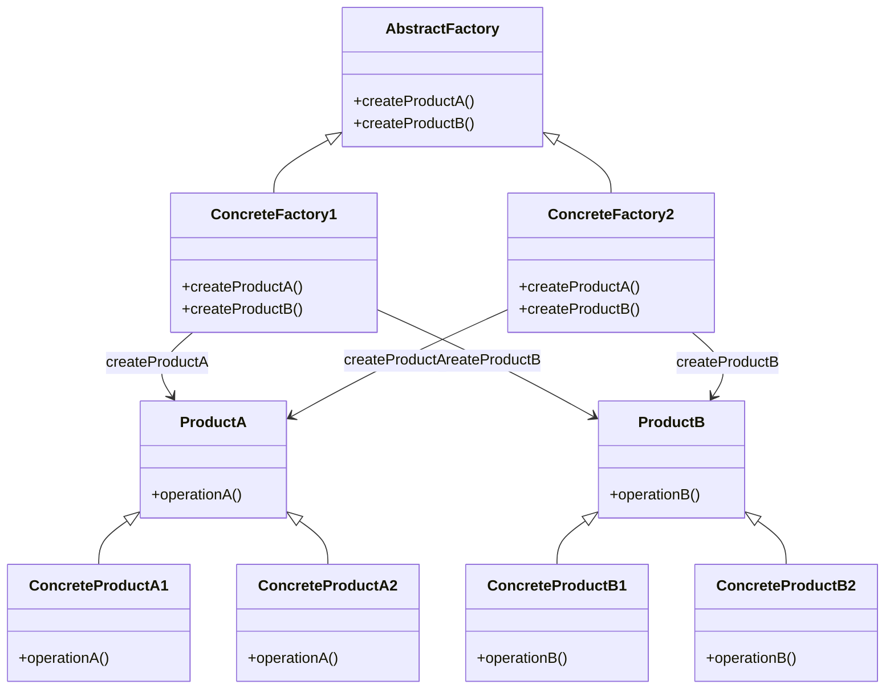

# Intent
Provide an interface for creating families of related or dependent objects without specifying their concrete classes.

# Applicability
Use the Abstract Factory pattern when:
- A system should be independent of how its products are created, composed, and represented.
- A system should be configurable with one of many families of products.
- A family of related product objects is designed to be used together, and you need to enforce this constraint.
- You want to provide a class library of products, and you want to reveal just their interfaces, not their implementations.

# Structure

