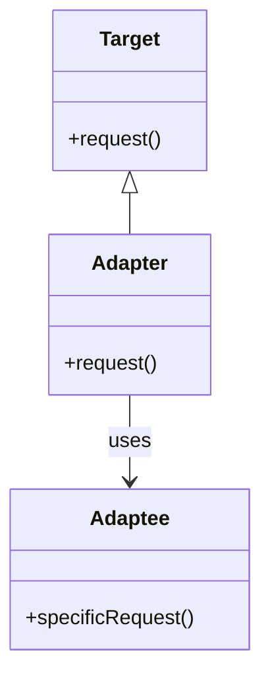

# Intent
Convert the interface of a class into another interface clients expect. Adapter lets classes work together that couldn't otherwise because of incompatible interfaces.

# Applicability
Use the Adapter pattern when:
- You want to use an existing class, but its interface doesn't match the one you need.
- You want to create a reusable class that cooperates with unrelated or unforeseen classes, that is, the classes that don't necesarily have compatible interfaces.
- You need to use several existing subclasses, but it's impractical to adapt each of them by subclassing.

# Structure

