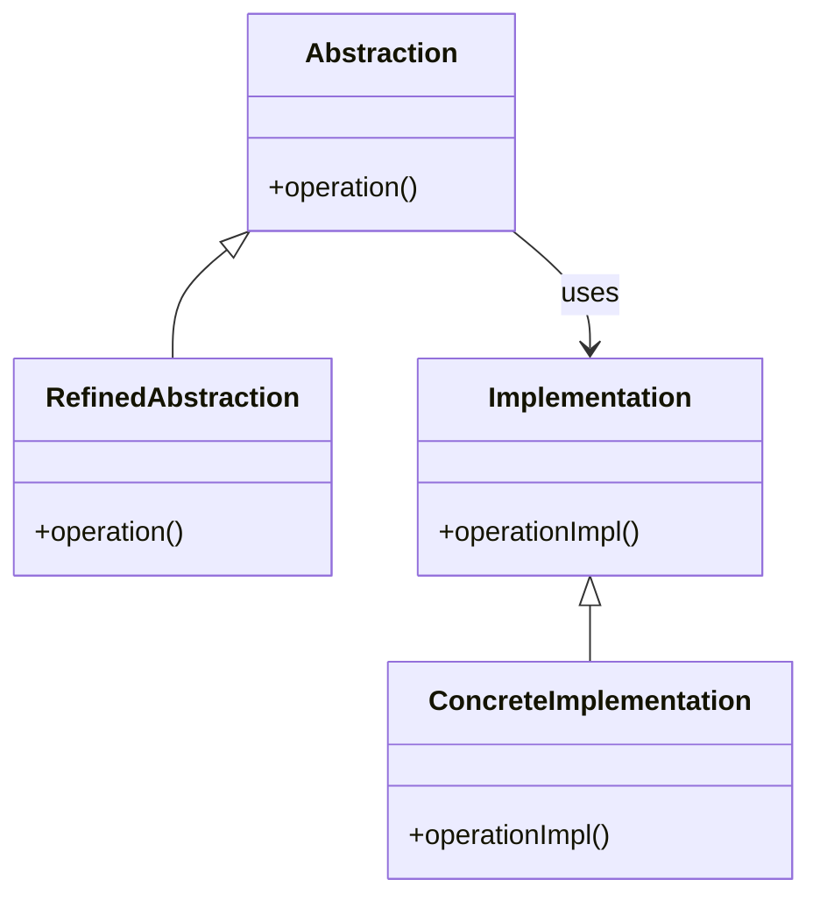

# Intent
Decouple an abstraction from its implementation so that the two can vary independently.

# Applicability
Use the Bridge pattern when:
- You want to avoid a permanent binding between an abstraction and its implementation. This might be the case, for example, when the implementation must be selected or switched at runtime.
- Both the abstractions and their implementations should be extensible by subclassing. 
- Changes in the implementation of an abstraction should have no impact on clients.
- You want to hide the implementation details from clients.

# Structure

    