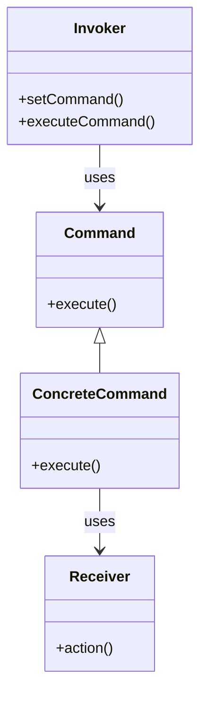

# Intent
Encapsulate a request as an object, thereby letting you parameterize clients with different requests, queue or log requests, and support undoable operations.

# Applicability
Use the Command pattern when you want to:
- Parameterize objects that invoke an operation by the type of operation they invoke. 
- Specify, queue, and execute operations at different times.
- Support undoable operations.
- Support logging changes so that they can be reapplied in case of system failure.
- Structure a system around high-level operations that are built on primitive operations.

# Structure
