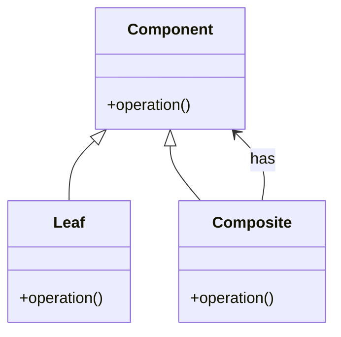

# Intent
Compose objects into tree structures to represent part-whole hierarchies. Composite lets clients treat individual objects and compositions of objects uniformly.

# Applicability
Use the Composite pattern when:
- You want to represent part-whole hierarchies of objects.
- You want clients to be able to ignore differences between composition of objects and individual objects.

# Structure

