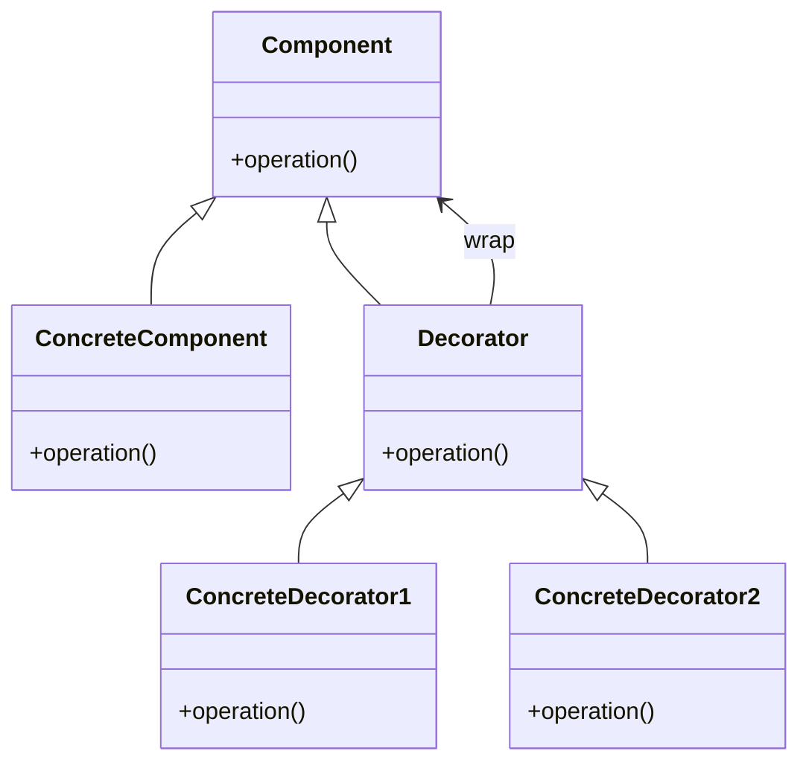

# Intent
Attache additional responsibilities to an object dynamically. Decorators provide a flexible alternative to subclassing for extending functionality.

# Applicability
Use Decorator:
- To add responsibilities to individual objects dynamically and transparently, without affecting other objects.
- For responsibilities that can be withdrawn. 
- When extension by subclassing is impractical. 

# Structure
