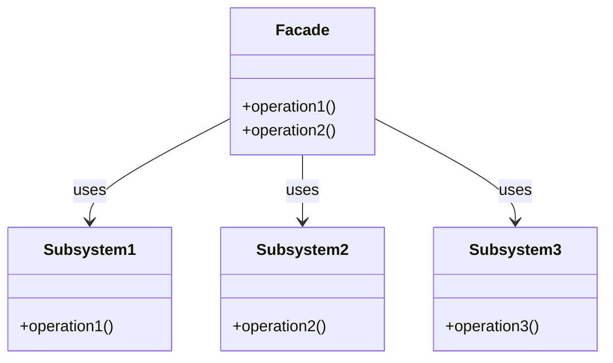

# Intent
Provide a unified interface to a set of interfaces in a subsystem. Facade defines a higher-level interface that makes the subsystem easier to use.

# Applicability
Use the Facade pattern when:
- You want to provide a simple interface to a complex subsystem.
- You want to decouple the subsystem from its clients and other subsystems.
- You want to layer your subsystem and provide a facade for each layer.

# Structure
