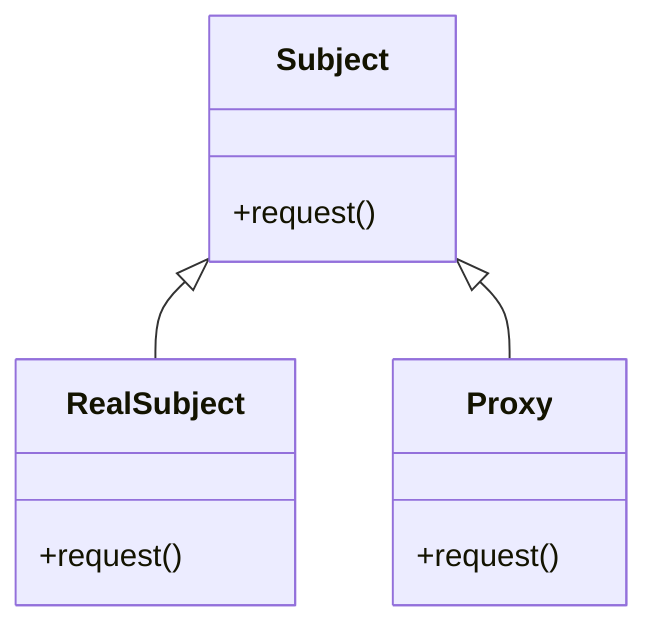

# Intent
Provide a surrogate or placeholder for another object to control access to it.

# Applicability
Proxy is applicable whenever there is a need for a more versitile or sophisticated reference to an object than a simple pointer. Here are several common situations in which the Proxy pattern is applicable:
- Remote Proxy: Provides a local representative for an object in a different address space.
- Virtual Proxy: Provides a surrogate for an object that is expensive to create or access.
- Protection Proxy: Controls access to the original object. Protection proxies are useful when objects should have different access rights.
- Smart Reference: Provides a more sophisticated reference to an object that can perform additional operations, such as caching or reference counting.

# Structure
