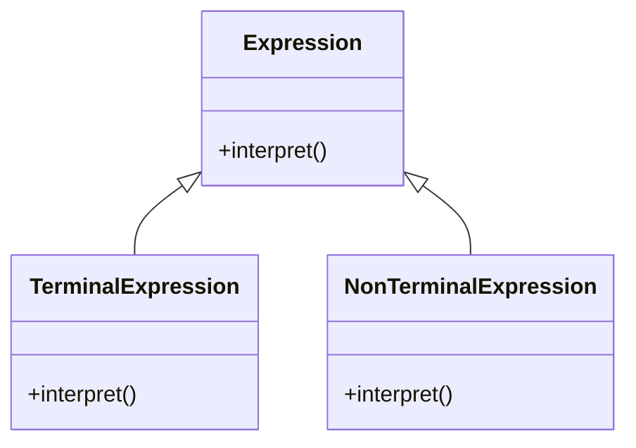

# Intent
Given a language, define a representation for its grammar along with an interpreter that uses the representation to interpret sentences in the language.

# Applicability
Use the Interpreter pattern when:
- A small grammar needs to be interpreted.
- Efficiency is not a critical requirement.

# Structure
