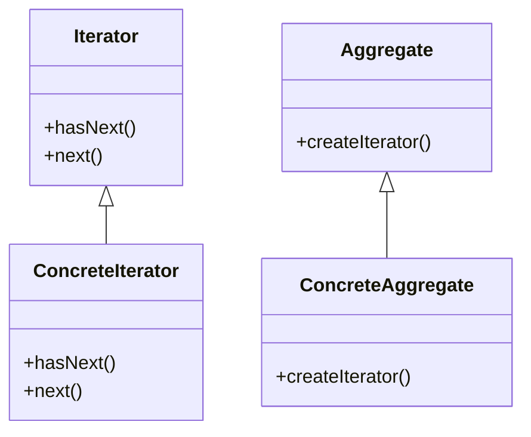

# Intent
Provide a way to access the elements of an aggregate object sequentially without exposing its underlying representation.

# Applicability
Use the Iterator pattern when:
- You want to access the elements of an aggregate object sequentially without exposing its underlying representation.
- You want to support multiple traversals of the same aggregate object.
- You want to provide a uniform interface for traversing different aggregate structures.

# Structure
