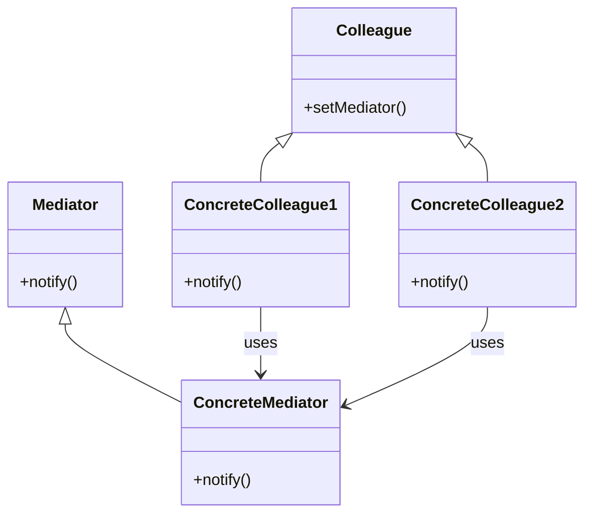

# Intent
Define an object that encapsulates how a set of objects interact. Mediator promotes loose coupling by keeping objects from referring to each other explicitly, and it lets you vary their interaction independently.

# Applicability
Use the Mediator pattern when:
- A set of objects communicate in well-defined but complex ways.
- Reusing an object is difficult because it referes to and communicates with many other objects.
- A behavior that's distributed between several classes should be customizable without a lot of subclassing.

# Structure

