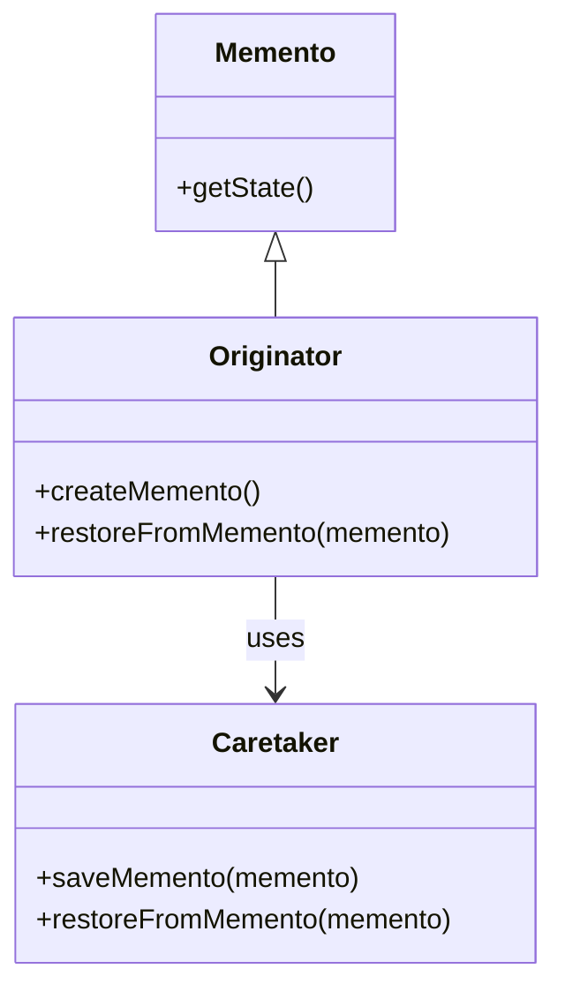

# Intent
Without violating encapsulation, capture and externalize an object's internal state so that the object can be restored to this state later.

# Applicability
Use the Memento pattern when:
- A snapshot of (or some portion of) some object's state must be saved so that it can be restored later.
- A direct interface to optaining the state would expose implementation details and break encapsulation.

# Structure

