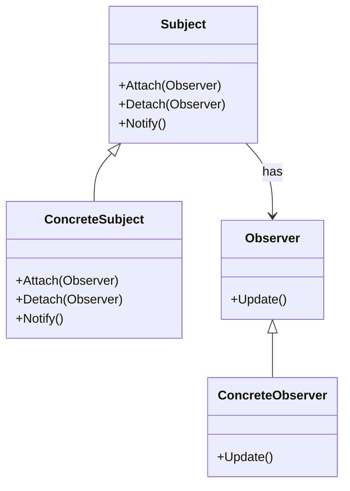

# Intent
Define a one-to-many dependency between objects so that when one object changes state, all its dependents are notified and updated automatically.

# Applicability
Use the Observer pattern when:
- An abstraction has two aspects, one of which depends on the other. Encapsulating these aspects in separate objects lets you vary and reuse them independently.
- A change in one object requires changes in many other objects and you don't know how many objects will need to change.
- An object should be able to notify other objects without making assumptions about who those objects are.

# Structure
