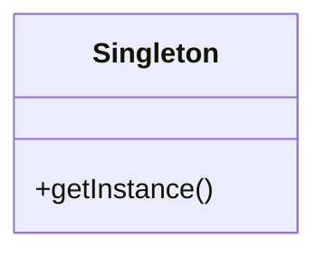

# Intent
Ensure a class only has one instance, and provide a global point of access to it.

# Applicability
Use the Singleton pattern when:
- There must be exactly one instance of a class and it must be accessible to clients from a well-known access point.
- When the sole instance should be extensible by subclassing, and clients should be able to use an extended instance without modifying their code.

# Structure
