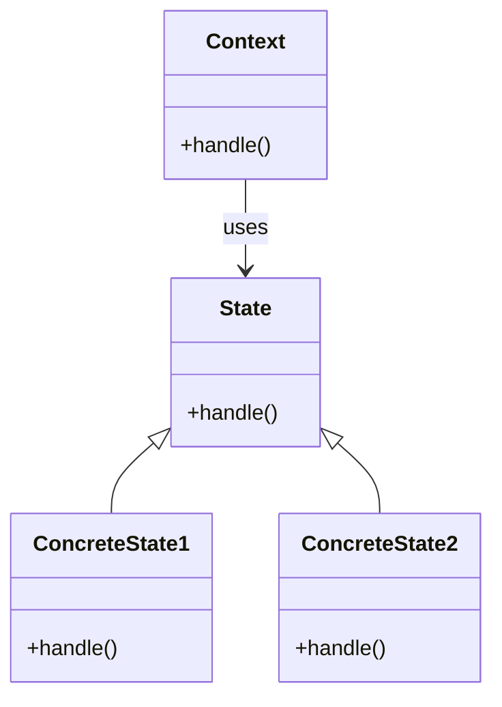

# Intent 
Allow an object to alter its behavior when its internal state changes. The object will appear to change its class.

# Applicability
Use the State pattern when:
- An object's behavior depends on its state, and it must change its behavior at runtime depending on that state.
- Operations have large, multipart conditional statements that change behavior depending on the object's state. 

# Structure
