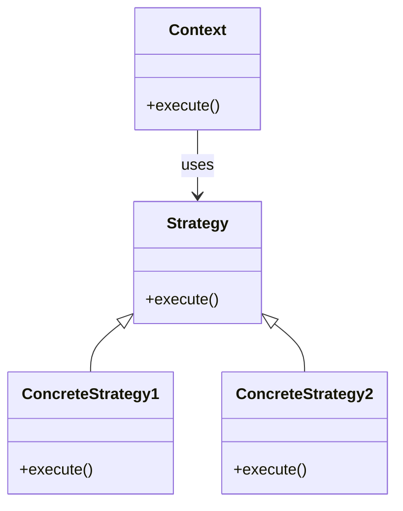

# Intent
Define a family of algorithms, encapsulate each one, and make them interchangeable. Strategy lets the algorithm vary independently from clients that use it. 

# Applicability
Use the Strategy pattern when:
- Many related classes differ only in their behavior (that is, have different algorithms to implement the same functionality).
- You need different variants of an algorithm.
- An algorithm uses data that clients shouldn't know about.
- A class defines many behaviors, and these behaviors appear as multiple conditional statements in its operations.

# Structure

