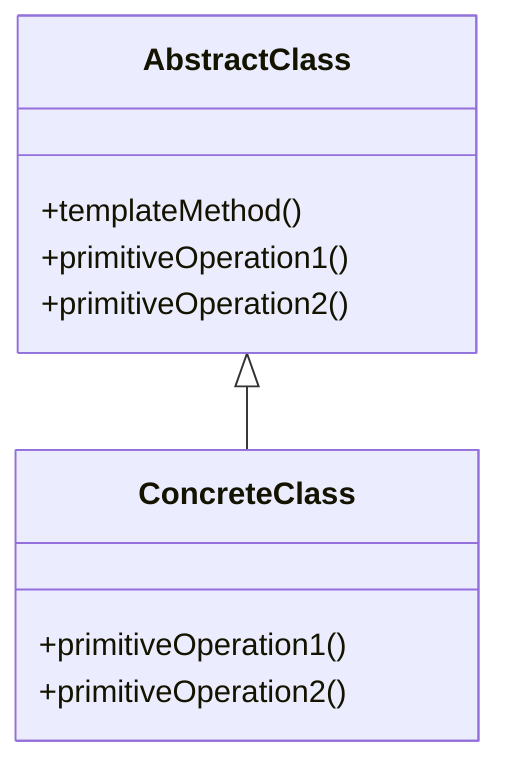

# Intent
Define the skeleton of an algorithm in an operation, deferring some steps to subclasses. Template Method lets subclasses redefine certain steps of an algorithm without changing the algorithm's structure. 

# Applicability
The Template Method pattern should be used:
- To implement the invariant parts of an algorithm once and leave it up to subclasses to implement the behavior that can vary.
- When a common behavior among subclasses should be factored out and localized in a common class to avoid code duplication.
- To control subclasses extensions. You can use hooks to control where and when subclasses can override the algorithm.

# Structure

