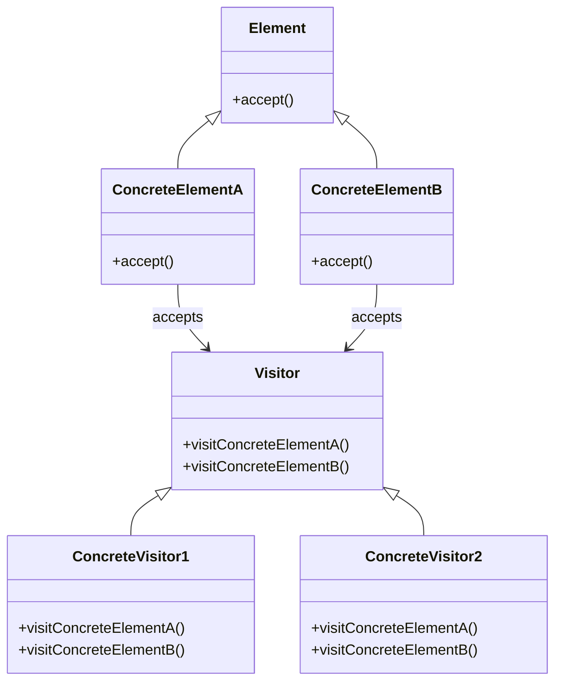

# Intent
Represent an operation to be performed on the elements of an object structure. Visitor lets you define a new operation without changing the classes of the elements on which it operates. 

# Applicability
Use the Visitor pattern when:
- An object structure contains many classes of objects with differing interfaces, and you want to perform operations on these objects that depend on their concrete classes.
- Many distinc and unrelated operations need to be performed on objects in an object structure, and you want to avoid "polluting" their with these operations.
- The classes defining the object structure rarely change, but you want to define new operations on them.

# Structure

